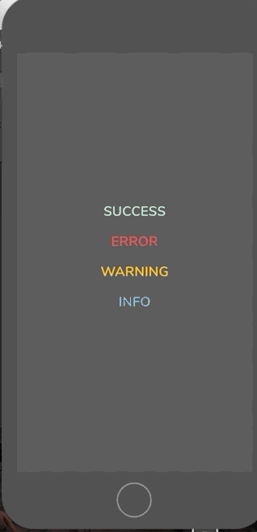

# React Native Scale Alerts

### Demo 




## Getting Started

- [Installation](#installation)
- [Basic Usage](#basic-usage)
- [Props](#props)

### Installation
```bash
$ npm i react-native-scale-alert --save
```

### Basic Usage
```jsx
import React from 'react';
import { StyleSheet, View, Text, TouchableOpacity } from 'react-native';

import Alert from 'react-native-scale-alert';

export default class App extends React.Component {

  constructor(props) {
    super(props);
    this.state = {
		visible:false
	};
  };

	showAlert = (status) => {
        this.setState({
            visible: status
        })
    }
	
  render() {
    const {visible} = this.state;

    return (
       <View style={styles.container}>
                <TouchableOpacity 
					onPress={() => this.showAlert('success')}
					style={styles.buttonStyle}
				>
                    <Text style={styles.textStyle}>
                        CLICK ME
                    </Text>
                </TouchableOpacity>
                <Alert
                    overlay={true}
					overlayColor='rgba(0,0,0,0.1)'
                    visible={visible}
                    status={visible}
                    title='SUCCESS'
                    message='Lorem ipsum dolor sit amet.'
                    showButton={true}
                />
            </View>
    );
  };
};

const styles = StyleSheet.create({
container: {
        flex: 1,
        alignItems: 'center',
        justifyContent: 'center'
    },
    textStyle: {
        fontSize: 24
    }
});

```


### Props

#### Basic

| Prop                     | Type      | Description                                    | Default |
| :----------------------- | :-------: | :--------------------------------------------: | :------ |
| visible                     | `boolean` | Show / Hide alert                      | false   |
| title                    | `string`  | Title text to display                          | hidden  |
| message                  | `string`  | Message text to display                        | hidden  |
| showButton        | `bool`    | Show a confirmation button                     | false   |
| buttonText        | `bool`    | Confirmation button text                   | false   |
| overlay        | `bool`    | Show a overlay                | false   |
| status        | `string`    | Indicates the status of the alert               | false   |
| propIcon        | `object`    | Icon customization              | false   |
| onConfirmPressed         | `func`    | Action to perform when Confirm is pressed      | -       |

#### Styling

| Prop                   | Type     | Description                  | Default |
| :--------------------- | :------: | :--------------------------: | :------ |
| containerStyle    | `object` | Alert popup  style | -       |
| overlayColor           | `string` | Overlay color change                | -       |
| titleStyle             | `object` | Title style                  | -       |
| messageStyle           | `object` | Message style                | -       |
| confirmButtonStyle     | `object` | Confirm button style         | -       |
| confirmButtonTextStyle | `object` | Confirm button text style    | -       |
| circleColor | `string` | Circle color style    | -       |

## Contribution

- [@farukozdemirz](mailto:frk.ozdmrr@gmail.com) Author.


## Questions

Feel free to [Contact me](mailto:frk.ozdmrr@gmail.com) or [Create an issue](https://github.com/farukozdemirz/react-native-scale-alert/issues/new)

## License

Released under the [Mit License](https://opensource.org/licenses/MIT)
